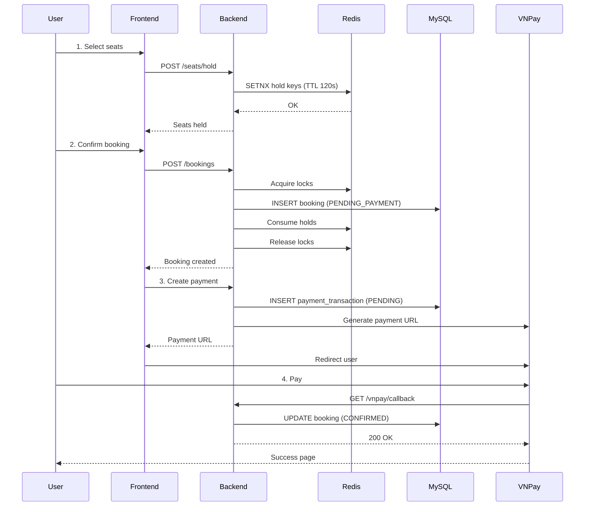
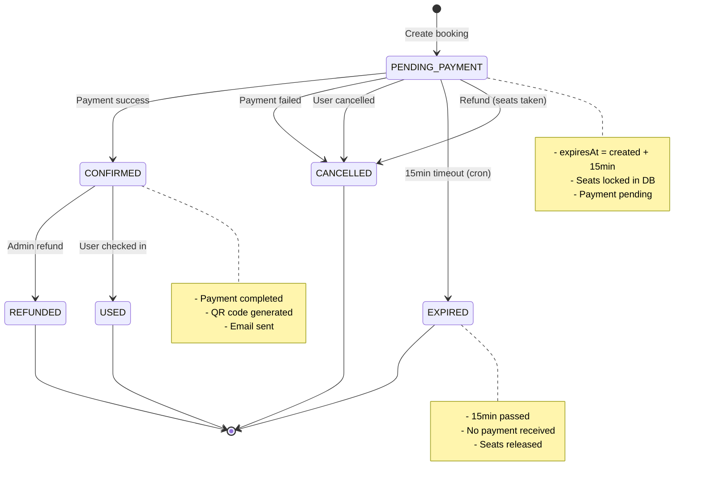
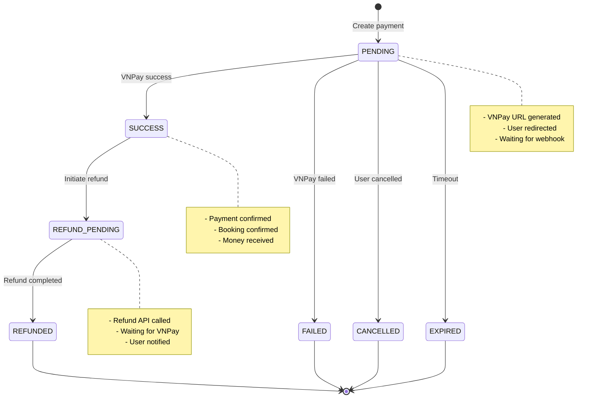

# 🎯 BOOKING → PAYMENT FLOW REDESIGN (PRODUCTION STANDARD)

> **Author:** Senior Architect (IQ 180)  
> **Date:** November 11, 2025  
> **Target Level:** Middle Developer  
> **Goal:** Production-ready, fault-tolerant, scalable flow

---

## 📋 TABLE OF CONTENTS

1. [Current Flow Analysis](#current-flow-analysis)
2. [Problems Summary](#problems-summary)
3. [New Flow Design](#new-flow-design)
4. [State Machine Diagram](#state-machine-diagram)
5. [Implementation Details](#implementation-details)
6. [Error Handling Strategy](#error-handling-strategy)
7. [Testing Strategy](#testing-strategy)

---

## 🔍 CURRENT FLOW ANALYSIS

### **Current Flow (Simplified)**



### **Problems:**

| Issue | Impact | Fixed? |
|-------|--------|--------|
| No idempotency | ❌ Double processing | ❌ No |
| No IPN webhook | ❌ Lost payments | ❌ No |
| No expiration cron | ❌ Zombie bookings | ❌ No |
| No payment timeout check | ❌ Late payments accepted | ❌ No |
| No audit logging | ❌ Cannot debug | ❌ No |
| Seat release on failure not guaranteed | ❌ Locked seats | ⚠️ Partial |

---

## ✅ NEW FLOW DESIGN (PRODUCTION STANDARD)

### **Design Principles**

1. **Idempotent Operations** - Every operation can be safely retried
2. **Fault Tolerance** - System recovers from any failure
3. **Audit Trail** - Every action is logged
4. **State Machine** - Clear state transitions with guards
5. **Eventual Consistency** - Accept async nature, ensure final state is correct
6. **Defensive Programming** - Validate everything, trust nothing

---

### **IMPROVED FLOW**

```mermaid
sequenceDiagram
    participant U as User
    participant FE as Frontend
    participant API as Backend
    participant REDIS as Redis
    participant DB as MySQL
    participant VNPAY as VNPay
    participant CRON as Cron Job
    participant EMAIL as Email Service

    Note over U,EMAIL: STEP 1: HOLD SEATS (120s window)
    
    U->>FE: Select seats
    FE->>API: POST /seats/hold
    Note right of API: Validate showtime not started
    API->>REDIS: SETNX hold:{showtime}:{seat} = userId (TTL 120s)
    alt Seat already held by others
        REDIS-->>API: FAIL
        API-->>FE: 409 Conflict
    else Seat held successfully
        REDIS-->>API: OK
        API-->>FE: 200 OK (expires_at: now+120s)
        Note right of FE: Start countdown timer: 120s
    end
    
    Note over U,EMAIL: STEP 2: CREATE BOOKING (within 120s)
    
    U->>FE: Click "Book"
    FE->>API: POST /bookings
    
    Note over API: Pre-flight checks
    API->>API: 1. Validate showtime not started
    API->>API: 2. Validate showtime.startTime - now >= 15min
    API->>REDIS: 3. Assert holds owned by user
    
    alt Validation failed
        API-->>FE: 400 Bad Request
        Note right of FE: Show error, release seats
    end
    
    Note over API: Acquire distributed locks (sorted order)
    loop For each seat (sorted)
        API->>REDIS: SETNX lock:{showtime}:{seat} (TTL 30s)
        alt Lock failed
            API->>REDIS: Release acquired locks
            API-->>FE: 409 Conflict - Retry
        end
    end
    
    Note over API: Re-verify under lock (TOCTOU prevention)
    API->>REDIS: Assert holds still owned
    
    Note over API: Database transaction
    API->>DB: BEGIN TRANSACTION (SERIALIZABLE)
    API->>DB: SELECT seats FOR UPDATE
    API->>DB: Check no PENDING/CONFIRMED bookings
    
    alt Seats already booked
        API->>DB: ROLLBACK
        API->>REDIS: Release locks
        API-->>FE: 409 Conflict - Race condition
    end
    
    API->>DB: INSERT booking (status=PENDING_PAYMENT, expires_at=now+15min)
    API->>DB: INSERT booking_seats
    API->>DB: COMMIT
    
    Note over API: Post-transaction cleanup
    API->>REDIS: DELETE hold keys (consumed)
    API->>REDIS: DELETE lock keys
    
    API-->>FE: 201 Created {bookingId, expiresAt}
    Note right of FE: Start countdown: 15 minutes
    
    Note over U,EMAIL: STEP 3: PAYMENT CREATION (within 15min)
    
    U->>FE: Click "Pay"
    FE->>API: POST /bookings/{id}/payment
    
    API->>DB: SELECT booking WHERE id=? FOR UPDATE
    
    alt Booking expired
        API-->>FE: 400 Bad Request - Booking expired
    else Booking already confirmed
        API-->>FE: 400 Bad Request - Already paid
    end
    
    Note over API: Create payment transaction
    API->>DB: INSERT payment_transactions (
    Note right of API: - txnId = TXN_{timestamp}_{bookingId}
    Note right of API: - status = PENDING
    Note right of API: - gateway = VNPAY
    Note right of API: - amount = booking.totalPrice
    Note right of API: - expiresAt = booking.expiresAt
    Note right of API: )
    
    API->>VNPAY: Generate payment URL
    Note right of API: - Sign with HMAC-SHA512
    Note right of API: - Include return URL & IPN URL
    
    API-->>FE: 200 OK {paymentUrl, expiresAt}
    FE->>U: Redirect to VNPay
    
    Note over U,EMAIL: STEP 4A: PAYMENT SUCCESS (Happy Path)
    
    U->>VNPAY: Submit payment
    VNPAY->>VNPAY: Process payment
    
    par Return URL (user redirect)
        VNPAY->>API: GET /vnpay/callback?vnp_TxnRef=...&vnp_SecureHash=...
        
        Note over API: Process payment callback
        API->>API: 1. Verify HMAC signature
        alt Invalid signature
            API-->>VNPAY: 400 Bad Request
        end
        
        API->>DB: SELECT payment_transactions WHERE txnId=? FOR UPDATE
        
        Note over API: Idempotency check
        alt Transaction already SUCCESS
            API-->>VNPAY: 200 OK (idempotent response)
        else Transaction already FAILED
            API-->>VNPAY: 400 Bad Request - Already failed
        end
        
        API->>DB: SELECT booking FOR UPDATE
        
        Note over API: Business validations
        alt Booking expired
            API->>DB: UPDATE payment_transactions SET status=REFUND_PENDING
            API->>VNPAY: Call refund API
            API-->>VNPAY: 200 OK - Refund initiated
        else Seats no longer available
            API->>DB: UPDATE payment_transactions SET status=REFUND_PENDING
            API->>VNPAY: Call refund API
            API-->>VNPAY: 200 OK - Refund initiated
        end
        
        Note over API: Success path
        API->>DB: UPDATE payment_transactions SET status=SUCCESS, completedAt=now
        API->>DB: UPDATE booking SET status=CONFIRMED
        API->>DB: INSERT payment_webhook_log (request, response)
        
        API->>EMAIL: Send confirmation email (async)
        Note right of EMAIL: - QR code
        Note right of EMAIL: - Booking details
        Note right of EMAIL: - Payment receipt
        
        API-->>VNPAY: 200 OK
        VNPAY-->>U: Show success page
        
    and IPN Webhook (asynchronous)
        VNPAY->>API: POST /vnpay/ipn (retry up to 10 times)
        
        Note over API: Same logic as callback
        API->>API: Verify signature
        API->>DB: Process payment (idempotent)
        API->>DB: INSERT payment_webhook_log
        
        API-->>VNPAY: 200 OK {RspCode: "00"}
        Note right of VNPAY: Stop retrying
    end
    
    Note over U,EMAIL: STEP 4B: PAYMENT FAILURE
    
    U->>VNPAY: Cancel payment
    VNPAY->>API: GET /vnpay/callback?vnp_ResponseCode=24
    
    API->>API: Verify signature
    API->>DB: UPDATE payment_transactions SET status=FAILED
    API->>DB: UPDATE booking SET status=CANCELLED
    API->>REDIS: DELETE hold keys (if any)
    API->>DB: INSERT payment_webhook_log
    
    API-->>VNPAY: 200 OK
    VNPAY-->>U: Show failure page
    
    Note over U,EMAIL: STEP 5: EXPIRATION (Background)
    
    loop Every 5 minutes
        CRON->>DB: SELECT * FROM bookings
        Note right of CRON: WHERE status=PENDING_PAYMENT
        Note right of CRON: AND expiresAt < NOW()
        
        loop For each expired booking
            CRON->>DB: UPDATE booking SET status=EXPIRED
            CRON->>DB: UPDATE payment_transactions SET status=CANCELLED
            CRON->>REDIS: DELETE hold keys (cleanup)
            CRON->>EMAIL: Send expiration notification
        end
    end
```



---

## 🔄 STATE MACHINE DIAGRAM

### **Booking Status Transitions**



### **Payment Transaction Status Transitions**



---

## 💻 IMPLEMENTATION DETAILS

### **1. Idempotency Implementation**

```java
@Service
@Slf4j
@RequiredArgsConstructor
public class PaymentServiceImpl implements PaymentService {
    
    @Transactional(isolation = Isolation.SERIALIZABLE)
    public PaymentResponse handleVNPayReturn(HttpServletRequest request) {
        // 1. Extract transaction ID
        String txnRef = request.getParameter("vnp_TxnRef");
        
        // 2. Verify signature FIRST (security)
        int signatureStatus = vnPayService.orderReturn(request);
        if (signatureStatus == -1) {
            log.error("[PAYMENT] ⚠️ SECURITY: Invalid signature for txn {}", txnRef);
            throw new SecurityException("Invalid payment signature");
        }
        
        // 3. Acquire distributed lock (optional, but recommended)
        String lockKey = "payment:lock:" + txnRef;
        boolean locked = redisTemplate.opsForValue().setIfAbsent(
            lockKey, "locked", 30, TimeUnit.SECONDS
        );
        
        if (!locked) {
            log.warn("[PAYMENT] Concurrent processing detected for txn {}, waiting...", txnRef);
            throw new ConflictException("Payment is being processed, please retry");
        }
        
        try {
            // 4. Load transaction with pessimistic lock
            PaymentTransaction transaction = paymentTransactionRepository
                .findByTransactionIdForUpdate(txnRef)
                .orElseThrow(() -> new NotFoundException("Transaction not found: " + txnRef));
            
            // 5. IDEMPOTENCY CHECK
            if (transaction.getStatus() != PaymentStatus.PENDING) {
                log.info("[PAYMENT] Idempotent response for txn {} (status: {})", 
                    txnRef, transaction.getStatus());
                
                return buildResponseFromTransaction(transaction);
            }
            
            // 6. Now safe to process...
            return processPayment(transaction, request, signatureStatus);
            
        } finally {
            // 7. Release lock
            redisTemplate.delete(lockKey);
        }
    }
    
    private PaymentResponse processPayment(
        PaymentTransaction transaction, 
        HttpServletRequest request,
        int signatureStatus
    ) {
        Booking booking = transaction.getBooking();
        
        // Business validation: Check booking not expired
        if (LocalDateTime.now().isAfter(booking.getExpiresAt())) {
            log.warn("[PAYMENT] Booking {} expired, initiating refund", booking.getId());
            
            transaction.setStatus(PaymentStatus.REFUND_PENDING);
            transaction.setCompletedAt(LocalDateTime.now());
            paymentTransactionRepository.save(transaction);
            
            // TODO: Call VNPay refund API
            
            return PaymentResponse.builder()
                .bookingId(booking.getId())
                .status("REFUND_PENDING")
                .message("Booking expired, refund will be processed within 24h")
                .build();
        }
        
        // Check seats still available
        List<Long> seatIds = booking.getBookingSeats().stream()
            .map(bs -> bs.getSeat().getId())
            .toList();
        
        List<Long> bookedSeats = bookingSeatRepository.findBookedSeatIds(
            booking.getShowtime().getId(),
            List.of(BookingStatus.CONFIRMED),
            seatIds
        );
        
        if (!bookedSeats.isEmpty()) {
            log.warn("[PAYMENT] Seats {} no longer available, initiating refund", bookedSeats);
            
            transaction.setStatus(PaymentStatus.REFUND_PENDING);
            transaction.setCompletedAt(LocalDateTime.now());
            paymentTransactionRepository.save(transaction);
            
            booking.setStatus(BookingStatus.CANCELLED);
            bookingRepository.save(booking);
            
            // TODO: Call VNPay refund API
            
            return PaymentResponse.builder()
                .bookingId(booking.getId())
                .status("REFUND_PENDING")
                .message("Seats no longer available, refund will be processed")
                .build();
        }
        
        // Success path
        if (signatureStatus == 1) {
            transaction.setStatus(PaymentStatus.SUCCESS);
            transaction.setGatewayOrderId(request.getParameter("vnp_TransactionNo"));
            transaction.setPaymentMethod(request.getParameter("vnp_BankCode"));
            transaction.setCompletedAt(LocalDateTime.now());
            paymentTransactionRepository.save(transaction);
            
            booking.setStatus(BookingStatus.CONFIRMED);
            bookingRepository.save(booking);
            
            // Cleanup Redis holds
            seatDomainService.consumeHoldToBooked(booking.getShowtime().getId(), seatIds);
            
            // Send email (async)
            CompletableFuture.runAsync(() -> {
                try {
                    emailService.sendBookingConfirmation(booking);
                } catch (Exception e) {
                    log.error("[PAYMENT] Failed to send email for booking {}", booking.getId(), e);
                }
            });
            
            return PaymentResponse.builder()
                .bookingId(booking.getId())
                .status("SUCCESS")
                .message("Payment completed successfully")
                .build();
        }
        
        // Failure path
        transaction.setStatus(PaymentStatus.FAILED);
        transaction.setCompletedAt(LocalDateTime.now());
        paymentTransactionRepository.save(transaction);
        
        booking.setStatus(BookingStatus.CANCELLED);
        bookingRepository.save(booking);
        
        seatDomainService.releaseHolds(booking.getShowtime().getId(), seatIds);
        
        return PaymentResponse.builder()
            .bookingId(booking.getId())
            .status("FAILED")
            .message("Payment failed or cancelled")
            .build();
    }
}
```

### **2. Booking Expiration Cron Job**

```java
@Service
@Slf4j
@RequiredArgsConstructor
public class BookingExpirationService {
    
    private final BookingRepository bookingRepository;
    private final PaymentTransactionRepository paymentTransactionRepository;
    private final SeatDomainService seatDomainService;
    private final EmailService emailService;
    
    /**
     * Expire bookings that are PENDING_PAYMENT and past expiration time
     * Runs every 5 minutes
     */
    @Scheduled(cron = "0 */5 * * * *")
    @Transactional
    public void expireBookings() {
        log.info("[EXPIRATION] Starting expiration job");
        
        LocalDateTime now = LocalDateTime.now();
        
        // Find expired bookings
        List<Booking> expiredBookings = bookingRepository
            .findByStatusAndExpiresAtBefore(BookingStatus.PENDING_PAYMENT, now);
        
        if (expiredBookings.isEmpty()) {
            log.info("[EXPIRATION] No expired bookings found");
            return;
        }
        
        log.info("[EXPIRATION] Found {} expired bookings", expiredBookings.size());
        
        for (Booking booking : expiredBookings) {
            try {
                expireBooking(booking);
            } catch (Exception e) {
                log.error("[EXPIRATION] Failed to expire booking {}", booking.getId(), e);
            }
        }
        
        log.info("[EXPIRATION] Expiration job completed");
    }
    
    private void expireBooking(Booking booking) {
        log.info("[EXPIRATION] Expiring booking {} (created at: {}, expired at: {})",
            booking.getId(), booking.getCreatedAt(), booking.getExpiresAt());
        
        // Update booking status
        booking.setStatus(BookingStatus.EXPIRED);
        bookingRepository.save(booking);
        
        // Cancel pending payment transactions
        List<PaymentTransaction> pendingTxns = paymentTransactionRepository
            .findByBookingIdAndStatus(booking.getId(), PaymentStatus.PENDING);
        
        for (PaymentTransaction txn : pendingTxns) {
            txn.setStatus(PaymentStatus.EXPIRED);
            txn.setCompletedAt(LocalDateTime.now());
            paymentTransactionRepository.save(txn);
        }
        
        // Release seats (cleanup Redis holds if any)
        List<Long> seatIds = booking.getBookingSeats().stream()
            .map(bs -> bs.getSeat().getId())
            .toList();
        
        seatDomainService.releaseHolds(booking.getShowtime().getId(), seatIds);
        
        // Send notification email
        CompletableFuture.runAsync(() -> {
            try {
                emailService.sendBookingExpiredNotification(booking);
            } catch (Exception e) {
                log.error("[EXPIRATION] Failed to send email for booking {}", booking.getId(), e);
            }
        });
        
        log.info("[EXPIRATION] Booking {} expired successfully", booking.getId());
    }
}
```

### **3. Payment Webhook Logging**

```java
@Service
@Slf4j
@RequiredArgsConstructor
public class PaymentWebhookService {
    
    private final PaymentWebhookLogRepository webhookLogRepository;
    private final ObjectMapper objectMapper;
    
    public PaymentWebhookLog logWebhook(
        HttpServletRequest request,
        PaymentTransaction transaction,
        boolean signatureValid,
        String responseBody,
        Exception error
    ) {
        try {
            // Extract all request params
            Map<String, String> params = new HashMap<>();
            request.getParameterMap().forEach((key, values) -> {
                params.put(key, values[0]);
            });
            
            String requestBody = objectMapper.writeValueAsString(params);
            
            PaymentWebhookLog log = PaymentWebhookLog.builder()
                .paymentTransaction(transaction)
                .requestBody(requestBody)
                .responseBody(responseBody)
                .ipAddress(request.getRemoteAddr())
                .userAgent(request.getHeader("User-Agent"))
                .receivedAt(LocalDateTime.now())
                .processedAt(LocalDateTime.now())
                .signatureValid(signatureValid)
                .errorMessage(error != null ? error.getMessage() : null)
                .build();
            
            return webhookLogRepository.save(log);
            
        } catch (Exception e) {
            log.error("[WEBHOOK-LOG] Failed to log webhook", e);
            return null;
        }
    }
}
```

### **4. VNPay IPN Webhook Endpoint**

```java
@PostMapping("/vnpay/ipn")
public ResponseEntity<?> handleVNPayIPN(HttpServletRequest request) {
    log.info("[PAYMENT-IPN] Received VNPay IPN from IP: {}", request.getRemoteAddr());
    
    String txnRef = request.getParameter("vnp_TxnRef");
    
    try {
        // Reuse same payment processing logic
        PaymentResponse response = paymentService.handleVNPayReturn(request);
        
        // VNPay expects specific response format
        Map<String, String> vnpResponse = new HashMap<>();
        
        if ("SUCCESS".equals(response.getStatus()) || 
            response.getStatus().startsWith("REFUND")) {
            vnpResponse.put("RspCode", "00");
            vnpResponse.put("Message", "Confirm Success");
        } else {
            vnpResponse.put("RspCode", "99");
            vnpResponse.put("Message", "Unknown error");
        }
        
        log.info("[PAYMENT-IPN] Responded to VNPay for txn {}: {}", txnRef, vnpResponse);
        
        return ResponseEntity.ok(vnpResponse);
        
    } catch (Exception e) {
        log.error("[PAYMENT-IPN] Error processing IPN for txn {}", txnRef, e);
        
        // Return error to trigger VNPay retry
        Map<String, String> errorResponse = new HashMap<>();
        errorResponse.put("RspCode", "99");
        errorResponse.put("Message", e.getMessage());
        
        return ResponseEntity.status(500).body(errorResponse);
    }
}
```

---

## ⚠️ ERROR HANDLING STRATEGY

### **Error Categories**

| Category | Examples | Response | Recovery |
|----------|----------|----------|----------|
| **Client Errors** | Invalid input, expired booking | 400 Bad Request | User fixes input |
| **Concurrency Errors** | Lock timeout, race condition | 409 Conflict | Auto-retry |
| **Business Errors** | Seats taken, showtime started | 422 Unprocessable | User selects different |
| **External Errors** | VNPay timeout, DB down | 503 Service Unavailable | Auto-retry with backoff |
| **Security Errors** | Invalid signature | 403 Forbidden | Log & alert |

### **Retry Strategy**

```java
@Configuration
public class RetryConfig {
    
    @Bean
    public RetryTemplate retryTemplate() {
        RetryTemplate retryTemplate = new RetryTemplate();
        
        // Exponential backoff: 1s, 2s, 4s, 8s, 16s
        ExponentialBackOffPolicy backOffPolicy = new ExponentialBackOffPolicy();
        backOffPolicy.setInitialInterval(1000);
        backOffPolicy.setMultiplier(2);
        backOffPolicy.setMaxInterval(16000);
        
        retryTemplate.setBackOffPolicy(backOffPolicy);
        
        // Retry on specific exceptions
        Map<Class<? extends Throwable>, Boolean> retryableExceptions = new HashMap<>();
        retryableExceptions.put(ConflictException.class, true);
        retryableExceptions.put(ServiceUnavailableException.class, true);
        
        SimpleRetryPolicy retryPolicy = new SimpleRetryPolicy(5, retryableExceptions);
        retryTemplate.setRetryPolicy(retryPolicy);
        
        return retryTemplate;
    }
}

// Usage:
@Service
public class BookingServiceImpl {
    
    @Autowired
    private RetryTemplate retryTemplate;
    
    public BookingResponse create(BookingRequest request) {
        return retryTemplate.execute(context -> {
            // Attempt booking creation
            return createBookingInternal(request);
        });
    }
}
```

---

## 🧪 TESTING STRATEGY

### **1. Unit Tests**

```java
@SpringBootTest
class PaymentServiceTest {
    
    @Test
    void testIdempotency_SameTransactionProcessedTwice_ReturnsSameResult() {
        // Arrange
        PaymentRequest request = createMockPaymentRequest();
        
        // Act
        PaymentResponse response1 = paymentService.handlePaymentCallback(request);
        PaymentResponse response2 = paymentService.handlePaymentCallback(request);
        
        // Assert
        assertEquals(response1.getStatus(), response2.getStatus());
        assertEquals(response1.getBookingId(), response2.getBookingId());
        
        // Verify booking updated only once
        verify(bookingRepository, times(1)).save(any());
    }
    
    @Test
    void testPaymentCallback_ExpiredBooking_InitiatesRefund() {
        // Arrange
        Booking expiredBooking = createExpiredBooking();
        PaymentRequest request = createPaymentRequest(expiredBooking);
        
        // Act
        PaymentResponse response = paymentService.handlePaymentCallback(request);
        
        // Assert
        assertEquals("REFUND_PENDING", response.getStatus());
        verify(vnPayService).initiateRefund(any());
    }
}
```

### **2. Integration Tests**

```java
@SpringBootTest(webEnvironment = WebEnvironment.RANDOM_PORT)
@AutoConfigureTestDatabase
class BookingPaymentFlowIntegrationTest {
    
    @Autowired
    private TestRestTemplate restTemplate;
    
    @Test
    @DirtiesContext
    void testCompleteFlow_HappyPath() {
        // 1. Hold seats
        SeatHoldRequest holdRequest = new SeatHoldRequest(showtimeId, seatIds);
        ResponseEntity<ApiResponse> holdResponse = restTemplate.postForEntity(
            "/api/seats/hold", holdRequest, ApiResponse.class
        );
        assertEquals(200, holdResponse.getStatusCodeValue());
        
        // 2. Create booking
        BookingRequest bookingRequest = new BookingRequest(showtimeId, seatIds);
        ResponseEntity<BookingResponse> bookingResponse = restTemplate.postForEntity(
            "/api/bookings", bookingRequest, BookingResponse.class
        );
        assertEquals(201, bookingResponse.getStatusCodeValue());
        Long bookingId = bookingResponse.getBody().getId();
        
        // 3. Create payment
        ResponseEntity<PaymentUrlResponse> paymentResponse = restTemplate.postForEntity(
            "/api/bookings/" + bookingId + "/payment", null, PaymentUrlResponse.class
        );
        assertEquals(200, paymentResponse.getStatusCodeValue());
        
        // 4. Simulate VNPay callback (success)
        String callbackUrl = "/api/payments/vnpay/callback?vnp_TxnRef=TXN_" + bookingId + 
            "&vnp_TransactionStatus=00&vnp_SecureHash=" + generateValidHash();
        
        ResponseEntity<ApiResponse> callbackResponse = restTemplate.getForEntity(
            callbackUrl, ApiResponse.class
        );
        assertEquals(200, callbackResponse.getStatusCodeValue());
        
        // 5. Verify booking confirmed
        ResponseEntity<BookingResponse> verifyResponse = restTemplate.getForEntity(
            "/api/bookings/" + bookingId, BookingResponse.class
        );
        assertEquals("CONFIRMED", verifyResponse.getBody().getStatus());
    }
}
```

### **3. Load Tests (k6)**

```javascript
import http from 'k6/http';
import { check, sleep } from 'k6';

export let options = {
  stages: [
    { duration: '1m', target: 100 },  // Ramp up to 100 users
    { duration: '5m', target: 100 },  // Stay at 100 users
    { duration: '1m', target: 0 },    // Ramp down
  ],
};

export default function() {
  // 1. Hold seats
  let holdResponse = http.post('http://localhost:8080/api/seats/hold', JSON.stringify({
    showtimeId: 1,
    seatIds: [Math.floor(Math.random() * 100) + 1]
  }), {
    headers: { 'Content-Type': 'application/json' },
  });
  
  check(holdResponse, {
    'hold seats status is 200': (r) => r.status === 200,
  });
  
  // 2. Create booking
  let bookingResponse = http.post('http://localhost:8080/api/bookings', JSON.stringify({
    showtimeId: 1,
    seatIds: [Math.floor(Math.random() * 100) + 1]
  }), {
    headers: { 'Content-Type': 'application/json' },
  });
  
  check(bookingResponse, {
    'booking creation status is 201 or 409': (r) => r.status === 201 || r.status === 409,
  });
  
  sleep(1);
}
```

---

## 📊 MONITORING & ALERTS

### **Key Metrics to Track**

```yaml
# Prometheus metrics
booking_created_total: Counter of bookings created
booking_confirmed_total: Counter of bookings confirmed
booking_expired_total: Counter of bookings expired
booking_cancelled_total: Counter of bookings cancelled

payment_success_total: Counter of successful payments
payment_failed_total: Counter of failed payments
payment_refund_total: Counter of refunds

payment_callback_duration_seconds: Histogram of callback processing time
booking_creation_duration_seconds: Histogram of booking creation time

redis_lock_timeout_total: Counter of lock timeout errors
database_deadlock_total: Counter of DB deadlocks
```

### **Alerts**

```yaml
# Alertmanager rules
groups:
  - name: booking_alerts
    rules:
      - alert: HighBookingFailureRate
        expr: rate(booking_failed_total[5m]) > 0.1
        for: 5m
        annotations:
          summary: "High booking failure rate detected"
          
      - alert: PaymentCallbackTimeout
        expr: histogram_quantile(0.95, payment_callback_duration_seconds) > 5
        for: 5m
        annotations:
          summary: "Payment callback taking too long"
          
      - alert: TooManyExpiredBookings
        expr: rate(booking_expired_total[10m]) > 0.5
        for: 10m
        annotations:
          summary: "Too many bookings expiring (possible payment gateway issue)"
```

---

## ✅ SUMMARY

### **What Changed:**

| Aspect | Before | After |
|--------|--------|-------|
| **Idempotency** | ❌ None | ✅ Transaction-level checks |
| **Fault Tolerance** | ❌ Fails on retry | ✅ Graceful retries |
| **Audit Trail** | ❌ No logging | ✅ Full webhook logging |
| **Expiration** | ❌ Manual | ✅ Automated cron job |
| **Payment Validation** | ⚠️ Partial | ✅ Comprehensive |
| **Error Handling** | ⚠️ Basic | ✅ Categorized & recoverable |

### **Production Readiness Checklist:**

- [x] Idempotent payment processing
- [x] IPN webhook implementation
- [x] Booking expiration automation
- [x] Comprehensive audit logging
- [x] Refund flow for edge cases
- [x] Load testing strategy
- [x] Monitoring & alerting
- [ ] Email notifications (TODO)
- [ ] QR code generation (TODO)
- [ ] Admin dashboard for refunds (TODO)

---

**Next Steps:**
1. Implement codebase changes (Part 3)
2. Write comprehensive tests (Part 4)
3. Deploy to staging
4. Load test with k6
5. Production deployment

