# BOOKING SYSTEM - SEQUENCE DIAGRAM (FIXED VERSION)

## 🎬 Complete Booking Flow - Chuẩn xác sau khi fix

```mermaid
sequenceDiagram
    participant User as User/Frontend
    participant API as BookingController
    participant SeatService as SeatDomainService
    participant BookingService as BookingService
    participant RedisLock as RedisLockService
    participant Redis as Redis Cache
    participant DB as Database
    participant PaymentAPI as PaymentController
    participant PaymentService as PaymentService
    participant Gateway as Payment Gateway

    Note over User,Gateway: BƯỚC 1: HOLD SEATS (120 giây)
    
    User->>API: POST /api/seats/hold<br/>{showtimeId, seatIds, ttlSec:120}
    API->>SeatService: holdSeats(showtimeId, seatIds, userId, 120s)
    
    loop For each seat (ATOMIC)
        SeatService->>Redis: SETNX hold:123:1 = userId (TTL 120s)
        alt Seat available
            Redis-->>SeatService: OK (hold acquired)
        else Seat held by others
            Redis-->>SeatService: FAIL
            SeatService-->>API: ❌ ConflictException: Ghế đang được giữ
            API-->>User: 409 Conflict
        end
    end
    
    SeatService-->>API: ✅ All seats held
    API-->>User: 200 OK - Seats held for 120s
    
    Note over User: User có 120 giây để proceed to booking

    Note over User,Gateway: BƯỚC 2: CREATE BOOKING

    User->>API: POST /api/bookings<br/>{showtimeId, seatIds}
    API->>BookingService: create(request)
    
    BookingService->>BookingService: 1. Validate showtime exists
    
    Note over BookingService,Redis: 2. PRE-CHECK: Verify holds
    BookingService->>SeatService: assertHeldByUser(showtimeId, seatIds, userId)
    loop For each seat
        SeatService->>Redis: GET hold:123:1
        alt Hold exists and owned by user
            Redis-->>SeatService: userId (match)
        else Hold expired or wrong owner
            Redis-->>SeatService: null / wrong userId
            SeatService-->>BookingService: ❌ ConflictException
            BookingService-->>API: Error
            API-->>User: 409 Conflict - Hold expired
        end
    end
    SeatService-->>BookingService: ✅ All holds verified
    
    Note over BookingService,Redis: 3. ACQUIRE LOCKS (sorted order)
    loop For each seat (sorted: 1,2,3)
        BookingService->>RedisLock: tryLockSeat(showtimeId, seatId, 30s)
        RedisLock->>Redis: SETNX seat:lock:123:1 = UUID (30s)
        alt Lock acquired
            Redis-->>RedisLock: OK
            RedisLock-->>BookingService: true
        else Lock failed
            Redis-->>RedisLock: FAIL
            RedisLock-->>BookingService: false
            Note over BookingService: Rollback: release acquired locks
            BookingService-->>API: ❌ ConflictException
            API-->>User: 409 Conflict - Retry
        end
    end
    
    Note over BookingService,Redis: 4. RE-CHECK under lock (TOCTOU prevention)
    BookingService->>SeatService: assertHeldByUser (again)
    SeatService->>Redis: Verify holds still valid
    Redis-->>SeatService: ✅ Valid
    
    Note over BookingService,DB: 5. CHECK DB for booked seats
    BookingService->>DB: SELECT booking_seats WHERE<br/>showtime=123 AND status IN (PENDING_PAYMENT, CONFIRMED)
    alt Seats already booked
        DB-->>BookingService: [seat 1, seat 2]
        BookingService-->>API: ❌ ConflictException: Ghế đã được đặt
        Note over BookingService: Release locks
        BookingService->>RedisLock: releaseSeatLock for all
        API-->>User: 409 Conflict
    else Seats available
        DB-->>BookingService: []
    end
    
    Note over BookingService,DB: 6. CREATE BOOKING (Transaction)
    BookingService->>BookingService: Calculate total price<br/>(VIP x1.3, STD x1.0)
    BookingService->>DB: INSERT INTO bookings<br/>(status=PENDING_PAYMENT, totalPrice, ...)
    DB-->>BookingService: booking_id = 456
    BookingService->>DB: INSERT INTO booking_seats<br/>(booking_id=456, seat_id, price)
    DB-->>BookingService: ✅ Saved
    
    Note over BookingService,Redis: 7. 🔥 CRITICAL: CONSUME HOLD
    BookingService->>SeatService: consumeHoldToBooked(showtimeId, seatIds)
    loop For each seat
        SeatService->>Redis: DEL hold:123:1
        SeatService->>Redis: DEL hold:123:2
        SeatService->>Redis: DEL hold:123:3
    end
    Note over Redis: Holds xóa vì đã persist trong DB
    
    Note over BookingService,Redis: 8. RELEASE LOCKS
    loop For each seat
        BookingService->>RedisLock: releaseSeatLock(showtimeId, seatId)
        RedisLock->>Redis: DEL seat:lock:123:1 (only if owner)
    end
    
    BookingService-->>API: ✅ BookingResponse (id=456, status=PENDING_PAYMENT)
    API-->>User: 200 OK<br/>"Complete payment within 15 minutes"

    Note over User,Gateway: BƯỚC 3: PAYMENT (TODO - Chưa triển khai gateway)

    User->>PaymentAPI: POST /api/payments/create/456
    PaymentAPI->>PaymentService: createPaymentUrl(bookingId=456)
    PaymentService->>DB: Verify booking exists & status=PENDING_PAYMENT
    DB-->>PaymentService: ✅ Booking found
    
    Note over PaymentService: TODO: Generate real payment URL<br/>(VNPay/MoMo/Stripe)
    PaymentService-->>PaymentAPI: paymentUrl = "https://gateway.com/pay?id=456"
    PaymentAPI-->>User: 200 OK {paymentUrl}
    
    User->>Gateway: Redirect to payment gateway
    Note over User,Gateway: User nhập thông tin thanh toán
    
    alt Payment SUCCESS
        Gateway->>PaymentAPI: POST /api/payments/callback<br/>{bookingId:456, status:"SUCCESS", signature}
        PaymentAPI->>PaymentService: handlePaymentCallback(request)
        
        Note over PaymentService: TODO: Verify signature
        
        PaymentService->>DB: UPDATE bookings SET status=CONFIRMED<br/>WHERE id=456
        DB-->>PaymentService: ✅ Updated
        
        PaymentService->>SeatService: consumeHoldToBooked (if any hold left)
        SeatService->>Redis: DEL holds (idempotent)
        
        PaymentService-->>PaymentAPI: PaymentResponse(status=SUCCESS)
        PaymentAPI-->>Gateway: 200 OK
        Gateway-->>User: ✅ Payment Success!
        
        Note over User: Booking CONFIRMED<br/>Ghế đã được đặt thành công
        
    else Payment FAILED / CANCELLED
        Gateway->>PaymentAPI: POST /api/payments/callback<br/>{bookingId:456, status:"FAILED"}
        PaymentAPI->>PaymentService: handlePaymentCallback(request)
        
        PaymentService->>DB: UPDATE bookings SET status=CANCELLED<br/>WHERE id=456
        DB-->>PaymentService: ✅ Updated
        
        PaymentService->>SeatService: releaseHolds(showtimeId, seatIds)
        SeatService->>Redis: DEL holds
        
        Note over Redis,DB: Ghế available cho user khác<br/>(booking_seats vẫn giữ để audit)
        
        PaymentService-->>PaymentAPI: PaymentResponse(status=FAILED)
        PaymentAPI-->>Gateway: 200 OK
        Gateway-->>User: ❌ Payment Failed
        
    else Timeout (15 phút không thanh toán)
        Note over DB: Cron job chạy mỗi 5 phút
        DB->>DB: Find bookings WHERE status=PENDING_PAYMENT<br/>AND bookingDate < now-15min
        DB->>DB: UPDATE status=EXPIRED
        DB->>SeatService: releaseHolds (cleanup Redis)
        SeatService->>Redis: DEL holds (if exists)
        
        Note over User: Booking EXPIRED<br/>User phải book lại
    end

    Note over User,Gateway: 🔄 ALTERNATIVE FLOW: User Cancel Payment

    User->>PaymentAPI: POST /api/payments/cancel/456
    PaymentAPI->>PaymentService: cancelPayment(456)
    PaymentService->>DB: UPDATE bookings SET status=CANCELLED
    PaymentService->>SeatService: releaseHolds(showtimeId, seatIds)
    SeatService->>Redis: DEL holds
    PaymentService-->>PaymentAPI: ✅ Cancelled
    PaymentAPI-->>User: 200 OK - Booking cancelled

```



---

## 🔐 KEY SECURITY MEASURES (ĐÃ FIX)

### 1. **ATOMIC Operations (Redis SETNX)**
```
❌ BAD:  check → set (race condition)
✅ GOOD: setIfAbsent (atomic)
```

### 2. **Distributed Lock (Per-Seat)**
```
❌ BAD:  Lock group [1,2,3] → deadlock possible
✅ GOOD: Lock each seat sorted [1,2,3] → no deadlock
```

### 3. **Double-Check (TOCTOU Prevention)**
```
Pre-check holds (fast fail)
  ↓
Acquire locks
  ↓
Re-check holds (under lock) ← Prevents race
  ↓
Check DB
  ↓
Persist booking
```

### 4. **Lock Ownership**
```
UUID owner = lock value
Only owner can unlock
Prevents accidental unlock by other threads
```

### 5. **Idempotent Operations**
```
consumeHoldToBooked() → safe to call multiple times
releaseHolds() → safe to call multiple times
```

---

## 📊 STATE TRANSITIONS

```
[NO BOOKING]
    ↓ (POST /bookings)
[PENDING_PAYMENT] ──(payment success)──→ [CONFIRMED] ✅
    │
    ├──(payment failed)──→ [CANCELLED] ❌
    │
    └──(timeout 15min)──→ [EXPIRED] ⏰
```

---

## ⚠️ IMPORTANT NOTES

1. **Ghế chỉ được book 1 lần cho MỖI SHOWTIME**
   - Cùng ghế có thể book cho showtime khác
   - Cùng screen nhưng khác thời gian → OK

2. **Booking_seats KHÔNG BAO GIỜ bị xóa**
   - Giữ lại để audit trail
   - Chỉ update booking.status

3. **Redis holds tự động expire sau TTL**
   - Default: 120s cho hold
   - Lock: 30s
   - Không cần cleanup thủ công

4. **Locks phải release trong finally block**
   - Đảm bảo unlock ngay cả khi có exception

5. **Payment gateway integration = TODO**
   - Cần implement signature verification
   - Cần handle webhook properly
   - Cần retry mechanism

---

**Version:** 2.0 (Fixed Race Conditions)  
**Last Updated:** 2025-11-07

