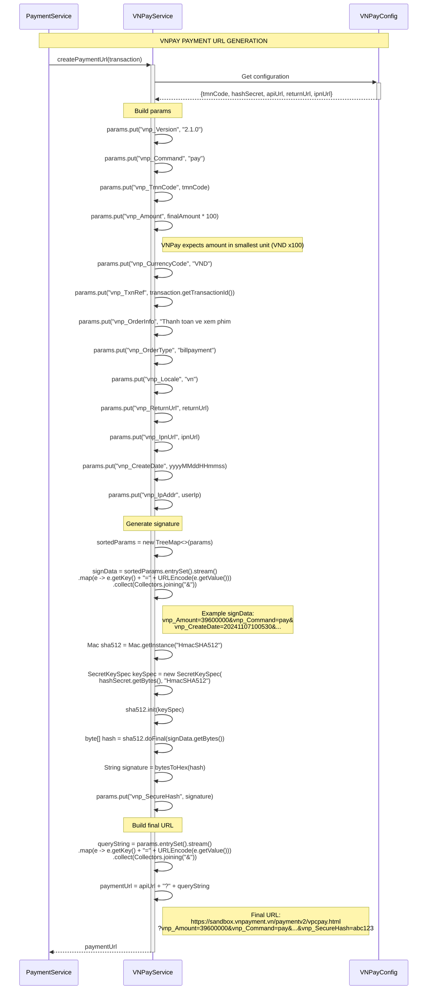
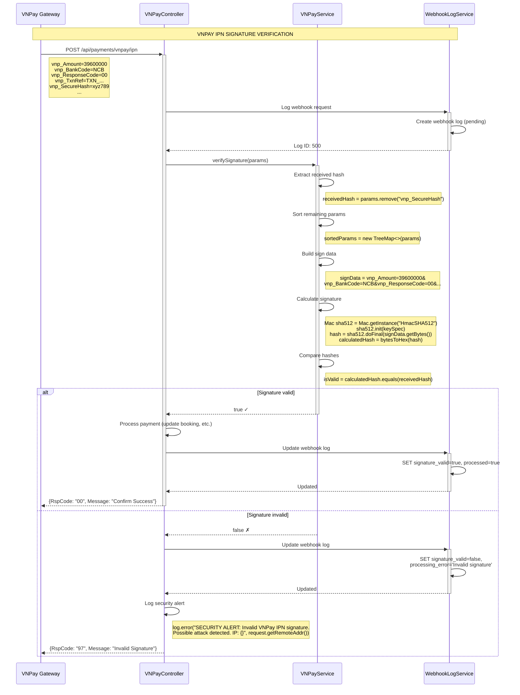
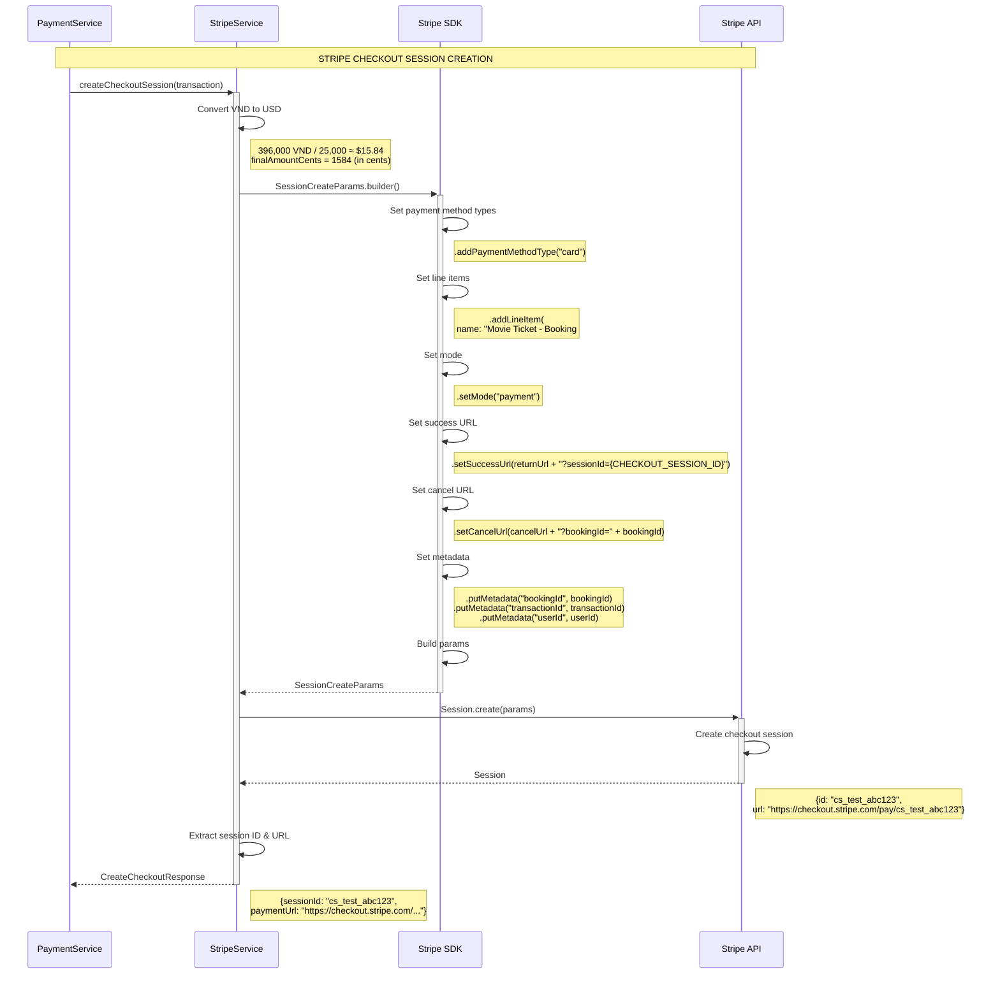
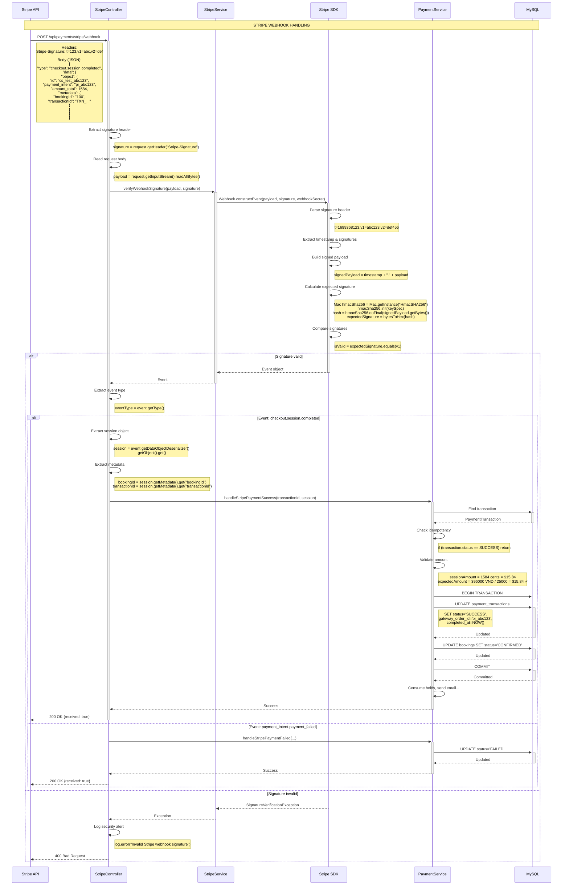
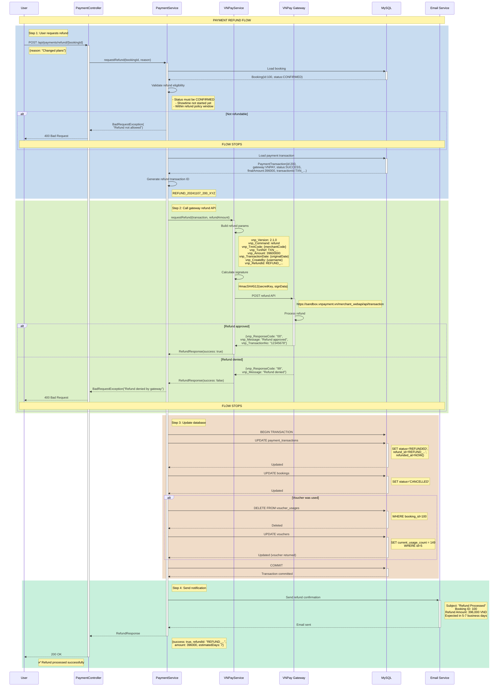

# 💳 Payment & Voucher Flow - Sequence Diagrams

> Detailed sequence diagrams cho Payment Gateway Integration và Voucher System

---

## 📋 Table of Contents

1. [Complete Payment Flow với Voucher](#1-complete-payment-flow-with-voucher)
2. [VNPay Payment Flow](#2-vnpay-payment-flow)
3. [Stripe Payment Flow](#3-stripe-payment-flow)
4. [Voucher Validation Flow](#4-voucher-validation-flow)
5. [Payment Webhook Flow](#5-payment-webhook-flow)
6. [Refund Flow](#6-refund-flow)

---

## 1. Complete Payment Flow with Voucher

### Overview Flow (End-to-End)

```mermaid
sequenceDiagram
    participant U as User
    participant FE as Frontend
    participant API as PaymentController
    participant PS as PaymentService
    participant VS as VoucherService
    participant VNP as VNPayService
    participant DB as MySQL
    participant REDIS as Redis
    participant GW as VNPay Gateway
    participant EMAIL as Email Service

    Note over U,EMAIL: COMPLETE PAYMENT FLOW WITH VOUCHER

    rect rgb(200, 220, 240)
    Note right of U: STEP 1: User completes booking
    U->>+FE: 1.1 Select seats
    FE->>+API: POST /api/seats/hold
    API->>+REDIS: SETNX hold keys
    REDIS-->>-API: Seats held (120s)
    API-->>-FE: Success
    FE-->>-U: Seats held, proceed to payment
    
    U->>+FE: 1.2 Create booking
    FE->>+API: POST /api/bookings
    API->>+DB: INSERT booking (PENDING_PAYMENT)
    DB-->>-API: Booking created (ID: 100)
    API-->>-FE: Booking created
    FE-->>-U: Booking created, pay within 15 min
    end

    rect rgb(220, 240, 200)
    Note right of U: STEP 2: Apply voucher (optional)
    U->>+FE: 2.1 Enter voucher code "SUMMER2024"
    FE->>+API: POST /api/vouchers/validate
    Note right of API: {code: "SUMMER2024", bookingId: 100}
    
    API->>+VS: validateVoucher(code, bookingId)
    
    VS->>+DB: SELECT * FROM vouchers WHERE code=?
    DB-->>-VS: Voucher found
    
    VS->>VS: Check status = ACTIVE
    VS->>VS: Check valid date range
    
    VS->>+DB: Count user usage
    Note right of VS: SELECT COUNT(*) FROM voucher_usages<br/>WHERE voucher_id=? AND user_id=?
    DB-->>-VS: Usage count: 0
    
    VS->>VS: Check usage < usagePerUser (0 < 1) ✓
    
    VS->>+DB: SELECT total_usage_count FROM vouchers
    DB-->>-VS: Current usage: 150
    
    VS->>VS: Check 150 < 1000 ✓
    
    VS->>+DB: Load booking
    DB-->>-VS: Booking(totalPrice: 495000)
    
    VS->>VS: Check minOrderAmount (495000 >= 200000) ✓
    
    Note over VS: Calculate discount
    VS->>VS: discountType = PERCENTAGE, value = 20
    VS->>VS: discount = 495000 * 0.2 = 99000
    VS->>VS: Check maxDiscount (99000 <= 100000) ✓
    VS->>VS: finalAmount = 495000 - 99000 = 396000
    
    VS-->>-API: ValidateVoucherResponse
    Note right of VS: {valid: true, discount: 99000,<br/>finalAmount: 396000}
    
    API-->>-FE: Voucher valid
    FE-->>-U: Discount applied! Pay 396,000 VND
    end

    rect rgb(240, 220, 200)
    Note right of U: STEP 3: Create payment URL
    U->>+FE: 3.1 Click "Pay with VNPay"
    FE->>+API: POST /api/payments/create/100
    Note right of API: {gateway: "VNPAY",<br/>voucherCode: "SUMMER2024"}
    
    API->>+PS: createPaymentUrl(request)
    
    PS->>+DB: Load booking
    DB-->>-PS: Booking(id:100, totalPrice:495000)
    
    PS->>PS: Validate status = PENDING_PAYMENT
    
    alt Voucher provided
        PS->>+VS: validateVoucher("SUMMER2024", 100)
        VS-->>-PS: ValidateVoucherResponse(finalAmount: 396000)
        PS->>PS: finalAmount = 396000
    else No voucher
        PS->>PS: finalAmount = 495000
    end
    
    PS->>PS: Generate unique transactionId
    Note right of PS: TXN_20241107_100_ABC123
    
    PS->>+DB: INSERT INTO payment_transactions
    Note right of PS: (booking_id: 100, gateway_type: VNPAY,<br/>transaction_id: TXN_..., amount: 495000,<br/>discount_amount: 99000, final_amount: 396000,<br/>status: PENDING, voucher_id: 5)
    DB-->>-PS: Transaction created (ID: 200)
    
    PS->>+VNP: createPaymentUrl(transaction)
    
    VNP->>VNP: Build VNPay params
    Note right of VNP: vnp_Version: 2.1.0<br/>vnp_Command: pay<br/>vnp_TmnCode: {merchantCode}<br/>vnp_Amount: 39600000 (x100)<br/>vnp_TxnRef: TXN_...<br/>vnp_OrderInfo: "Thanh toan ve xem phim"<br/>vnp_ReturnUrl: {returnUrl}<br/>vnp_IpnUrl: {webhookUrl}
    
    VNP->>VNP: Sort params alphabetically
    VNP->>VNP: Build sign data
    Note right of VNP: vnp_Amount=39600000&vnp_Command=pay&...
    
    VNP->>VNP: Calculate HMAC-SHA512 signature
    Note right of VNP: signature = HmacSHA512(secretKey, signData)
    
    VNP->>VNP: Add vnp_SecureHash to params
    
    VNP->>VNP: Build payment URL
    Note right of VNP: https://sandbox.vnpayment.vn/paymentv2/vpcpay.html<br/>?vnp_Amount=39600000&...&vnp_SecureHash=abc123
    
    VNP-->>-PS: paymentUrl
    
    PS->>+DB: UPDATE payment_transactions
    Note right of PS: SET gateway_request = {params JSON}
    DB-->>-PS: Updated
    
    PS-->>-API: CreatePaymentResponse
    Note right of PS: {paymentUrl, transactionId,<br/>finalAmount: 396000}
    
    API-->>-FE: Payment URL
    FE->>-U: Redirect to VNPay
    
    U->>+GW: Open payment URL
    GW-->>-U: Show payment form
    end

    rect rgb(240, 200, 220)
    Note right of U: STEP 4: User completes payment
    U->>U: Enter card info
    U->>+GW: Submit payment
    GW->>GW: Process payment
    GW-->>-U: Payment success!
    
    Note over GW,U: VNPay redirects user to returnUrl
    GW->>+FE: Redirect to /booking/success?vnp_Amount=...&vnp_SecureHash=...
    FE-->>-U: Show "Processing payment..."
    end

    rect rgb(200, 240, 220)
    Note right of GW: STEP 5: VNPay sends IPN (webhook)
    GW->>+API: POST /api/payments/vnpay/ipn
    Note right of GW: vnp_Amount=39600000<br/>vnp_TxnRef=TXN_...<br/>vnp_ResponseCode=00<br/>vnp_SecureHash=xyz789
    
    API->>+PS: handleVNPayIPN(params)
    
    PS->>+VNP: verifySignature(params)
    VNP->>VNP: Extract vnp_SecureHash from params
    VNP->>VNP: Build sign data (all params except hash)
    VNP->>VNP: Calculate HMAC-SHA512
    VNP->>VNP: Compare calculated vs received hash
    
    alt Signature valid
        VNP-->>PS: true ✓
        
        PS->>+DB: Find transaction by txnRef
        DB-->>-PS: PaymentTransaction(id: 200)
        
        PS->>PS: Check idempotency
        Note right of PS: if (transaction.status == SUCCESS) {<br/>  return cached response<br/>}
        
        PS->>PS: Validate vnp_Amount matches finalAmount
        Note right of PS: 39600000 / 100 = 396000 ✓
        
        alt Amount matches
            PS->>+DB: BEGIN TRANSACTION
            
            PS->>+DB: UPDATE payment_transactions
            Note right of PS: SET status='SUCCESS',<br/>gateway_response={params JSON},<br/>response_signature={hash},<br/>completed_at=NOW()
            DB-->>-PS: Updated
            
            PS->>+DB: UPDATE bookings
            Note right of PS: SET status='CONFIRMED'<br/>WHERE id=100
            DB-->>-PS: Updated
            
            alt Voucher was used
                PS->>+DB: INSERT INTO voucher_usages
                Note right of PS: (voucher_id: 5, user_id: 123,<br/>booking_id: 100, payment_txn_id: 200,<br/>original_amount: 495000,<br/>discount_amount: 99000,<br/>final_amount: 396000)
                DB-->>-PS: Usage recorded
                
                PS->>+DB: UPDATE vouchers
                Note right of PS: SET current_usage_count = 151<br/>WHERE id=5
                DB-->>-PS: Updated
            end
            
            PS->>+DB: COMMIT
            DB-->>-PS: Transaction committed
            
            PS->>+REDIS: Consume holds
            Note right of PS: DEL hold:10:1, hold:10:2, hold:10:3
            REDIS-->>-PS: Holds deleted
            
            PS->>+EMAIL: Send booking confirmation
            Note right of EMAIL: Generate QR code<br/>Booking ID: 100<br/>Seats: A1, A2, A3<br/>Movie: Spider-Man<br/>Showtime: 2024-11-07 10:00<br/>Total: 396,000 VND (Discount: 99,000)
            EMAIL-->>-PS: Email sent
            
            PS-->>-API: VNPayIPNResponse
            Note right of PS: {RspCode: "00", Message: "Confirm Success"}
            
            API-->>-GW: 200 OK
            
        else Amount mismatch
            PS->>+DB: UPDATE payment_transactions
            Note right of PS: SET status='FAILED',<br/>processing_error='Amount mismatch'
            DB-->>-PS: Updated
            
            PS->>+DB: UPDATE bookings
            Note right of PS: SET status='CANCELLED'
            DB-->>-PS: Updated
            
            PS->>+REDIS: Release holds
            REDIS-->>-PS: Released
            
            PS-->>API: VNPayIPNResponse
            Note right of PS: {RspCode: "97", Message: "Invalid Amount"}
            API-->>GW: 200 OK
        end
        
    else Signature invalid
        VNP-->>PS: false ✗
        
        PS->>+DB: INSERT INTO payment_webhook_logs
        Note right of PS: (gateway_type: VNPAY,<br/>request_body: {params},<br/>signature_valid: false,<br/>processing_error: 'Invalid signature')
        DB-->>-PS: Log created
        
        PS->>PS: Log security alert
        Note right of PS: log.error("SECURITY ALERT: Invalid VNPay signature")
        
        PS-->>API: VNPayIPNResponse
        Note right of PS: {RspCode: "97", Message: "Invalid Signature"}
        API-->>GW: 200 OK
    end
    end

    rect rgb(220, 220, 240)
    Note right of FE: STEP 6: Frontend polls for status
    FE->>+API: GET /api/payments/verify/100
    API->>+PS: verifyPaymentStatus(100)
    PS->>+DB: Load transaction
    DB-->>-PS: Transaction(status: SUCCESS)
    PS-->>-API: PaymentStatusResponse
    API-->>-FE: {status: "SUCCESS", finalAmount: 396000}
    
    FE-->>U: ✅ Payment successful!<br/>Check your email for ticket
    end
```



---

## 2. VNPay Payment Flow (Detailed)

### VNPay Payment URL Generation



### VNPay IPN Signature Verification



---

## 3. Stripe Payment Flow

### Stripe Checkout Session Creation



### Stripe Webhook Handling



---

## 4. Voucher Validation Flow

```mermaid
sequenceDiagram
    participant U as User
    participant API as VoucherController
    participant VS as VoucherService
    participant VR as VoucherRepository
    participant VUR as VoucherUsageRepository
    participant BR as BookingRepository

    Note over U,BR: VOUCHER VALIDATION FLOW

    U->>+API: POST /api/vouchers/validate
    Note right of U: {code: "SUMMER2024", bookingId: 100}
    
    API->>+VS: validateVoucher(code, bookingId)
    
    rect rgb(200, 220, 240)
    Note right of VS: Step 1: Check voucher exists
    VS->>+VR: findByCode("SUMMER2024")
    
    alt Voucher not found
        VR-->>VS: null
        VS-->>API: BadRequestException("Voucher not found")
        API-->>U: 400 Bad Request
        Note over U,BR: FLOW STOPS
    else Voucher found
        VR-->>-VS: Voucher(id:5, code:"SUMMER2024",<br/>discountType:PERCENTAGE, discountValue:20,<br/>minOrderAmount:200000, maxDiscountAmount:100000,<br/>totalUsageLimit:1000, usagePerUser:1,<br/>currentUsageCount:150, status:ACTIVE,<br/>validFrom:2024-11-01, validUntil:2024-12-31)
    end
    end

    rect rgb(220, 240, 200)
    Note right of VS: Step 2: Check status
    VS->>VS: if (voucher.status != ACTIVE)
    
    alt Status not ACTIVE
        VS-->>API: BadRequestException("Voucher is not active")
        API-->>U: 400 Bad Request
        Note over U,BR: FLOW STOPS
    else Status is ACTIVE
        VS->>VS: Continue ✓
    end
    end

    rect rgb(240, 220, 200)
    Note right of VS: Step 3: Check valid date range
    VS->>VS: LocalDateTime now = LocalDateTime.now()
    VS->>VS: if (now < validFrom || now > validUntil)
    
    alt Voucher expired or not yet valid
        VS-->>API: BadRequestException("Voucher has expired or not yet valid")
        API-->>U: 400 Bad Request
        Note over U,BR: FLOW STOPS
    else Valid date range
        VS->>VS: Continue ✓
    end
    end

    rect rgb(200, 240, 220)
    Note right of VS: Step 4: Check total usage limit
    VS->>VS: if (currentUsageCount >= totalUsageLimit)
    
    alt Usage limit reached
        VS-->>API: BadRequestException("Voucher usage limit exceeded")
        API-->>U: 400 Bad Request
        Note over U,BR: FLOW STOPS
    else Still available
        VS->>VS: Continue ✓ (150 < 1000)
    end
    end

    rect rgb(220, 220, 240)
    Note right of VS: Step 5: Check user usage limit
    VS->>VS: Long userId = getCurrentUserId()
    
    VS->>+VUR: countByVoucherIdAndUserId(5, 123)
    Note right of VUR: SELECT COUNT(*) FROM voucher_usages<br/>WHERE voucher_id=5 AND user_id=123
    VUR-->>-VS: userUsageCount: 0
    
    VS->>VS: if (userUsageCount >= usagePerUser)
    
    alt User exceeded limit
        VS-->>API: BadRequestException("You have already used this voucher")
        API-->>U: 400 Bad Request
        Note over U,BR: FLOW STOPS
    else User can use
        VS->>VS: Continue ✓ (0 < 1)
    end
    end

    rect rgb(240, 240, 200)
    Note right of VS: Step 6: Check minimum order amount
    VS->>+BR: findById(100)
    BR-->>-VS: Booking(id:100, totalPrice:495000)
    
    VS->>VS: if (booking.totalPrice < minOrderAmount)
    
    alt Order too small
        VS-->>API: BadRequestException(<br/>"Minimum order amount is 200,000 VND")
        API-->>U: 400 Bad Request
        Note over U,BR: FLOW STOPS
    else Meets minimum
        VS->>VS: Continue ✓ (495000 >= 200000)
    end
    end

    rect rgb(200, 220, 240)
    Note right of VS: Step 7: Check applicable scope (optional)
    
    alt Voucher has applicable_movie_ids
        VS->>VS: List<Long> applicableMovies = voucher.getApplicableMovieIds()
        VS->>VS: if (!applicableMovies.contains(booking.getShowtime().getMovie().getId()))
        
        alt Movie not applicable
            VS-->>API: BadRequestException(<br/>"Voucher not applicable for this movie")
            API-->>U: 400 Bad Request
            Note over U,BR: FLOW STOPS
        end
    end
    
    alt Voucher has applicable_days_of_week
        VS->>VS: int dayOfWeek = booking.getShowtime().getStartTime().getDayOfWeek().getValue()
        VS->>VS: if (!applicableDays.contains(dayOfWeek))
        
        alt Day not applicable
            VS-->>API: BadRequestException(<br/>"Voucher only valid on specific days")
            API-->>U: 400 Bad Request
            Note over U,BR: FLOW STOPS
        end
    end
    
    VS->>VS: All scope checks passed ✓
    end

    rect rgb(220, 240, 200)
    Note right of VS: Step 8: Calculate discount
    VS->>VS: BigDecimal originalAmount = booking.getTotalPrice()
    
    alt DiscountType = PERCENTAGE
        VS->>VS: discount = originalAmount * (discountValue / 100)
        Note right of VS: 495000 * 0.2 = 99000
        
        VS->>VS: if (maxDiscountAmount != null)
        VS->>VS: discount = min(discount, maxDiscountAmount)
        Note right of VS: min(99000, 100000) = 99000
        
    else DiscountType = FIXED_AMOUNT
        VS->>VS: discount = discountValue
        Note right of VS: Fixed 50,000 VND off
        
    else DiscountType = FREE_TICKET
        VS->>VS: // Calculate price of cheapest seat
        VS->>VS: discount = cheapestSeatPrice
        
    else DiscountType = BUY_X_GET_Y
        VS->>VS: // Check seat count
        VS->>VS: if (seatCount >= buyQuantity)
        VS->>VS:   discount = getQuantity * seatPrice
    end
    
    VS->>VS: finalAmount = originalAmount - discount
    Note right of VS: 495000 - 99000 = 396000
    
    VS->>VS: Build response
    VS-->>-API: ValidateVoucherResponse
    Note right of VS: {valid: true, voucherId: 5,<br/>code: "SUMMER2024",<br/>discountType: PERCENTAGE,<br/>discountValue: 20,<br/>originalAmount: 495000,<br/>discountAmount: 99000,<br/>finalAmount: 396000,<br/>remainingUsage: 850}
    
    API-->>-U: 200 OK
    end
```



---

## 5. Payment Webhook Flow (Async Processing)

```mermaid
sequenceDiagram
    participant GW as Payment Gateway
    participant API as WebhookController
    participant QUEUE as Message Queue
    participant WORKER as Webhook Worker
    participant PS as PaymentService
    participant DB as MySQL
    participant CACHE as Redis Cache

    Note over GW,CACHE: ASYNC WEBHOOK PROCESSING (High Volume)

    rect rgb(200, 220, 240)
    Note right of GW: Gateway sends webhook
    GW->>+API: POST /api/payments/webhook
    Note right of GW: Headers: Signature<br/>Body: Payment event JSON
    
    API->>API: Verify signature (fast)
    
    alt Signature invalid
        API-->>GW: 401 Unauthorized
        Note over GW,CACHE: FLOW STOPS
    end
    
    API->>+DB: INSERT INTO payment_webhook_logs
    Note right of API: (gateway_type, request_body,<br/>signature_valid: true,<br/>processed: false)
    DB-->>-API: Log ID: 500
    
    API->>+QUEUE: Publish webhook event
    Note right of QUEUE: {logId: 500, payload: {...}}
    QUEUE-->>-API: Message published
    
    API-->>-GW: 200 OK {received: true}
    Note right of API: Fast response (< 100ms)
    end

    rect rgb(220, 240, 200)
    Note right of WORKER: Background worker processes
    QUEUE->>+WORKER: Webhook event message
    
    WORKER->>+DB: Load webhook log
    DB-->>-WORKER: WebhookLog(id:500, payload:...)
    
    WORKER->>WORKER: Extract transaction ID
    
    WORKER->>+CACHE: Check if already processed
    Note right of CACHE: GET webhook:processed:{txnId}
    
    alt Already processed (idempotency)
        CACHE-->>WORKER: "PROCESSED"
        WORKER->>+DB: UPDATE webhook log
        Note right of DB: SET processed=true,<br/>processing_error='Duplicate event'
        DB-->>-WORKER: Updated
        WORKER-->>-QUEUE: ACK (skip processing)
        Note over QUEUE,CACHE: FLOW STOPS
    else Not processed
        CACHE-->>-WORKER: null
        
        WORKER->>+PS: processWebhookEvent(payload)
        
        PS->>+DB: BEGIN TRANSACTION
        
        PS->>+DB: Find transaction (FOR UPDATE)
        Note right of DB: SELECT * FROM payment_transactions<br/>WHERE transaction_id=? FOR UPDATE
        DB-->>-PS: Transaction (row locked)
        
        PS->>PS: Check current status
        
        alt Already SUCCESS
            PS->>PS: Log idempotency
            PS->>+DB: ROLLBACK
            DB-->>-PS: Rolled back
            PS-->>WORKER: "Already processed"
            
        else Status = PENDING
            PS->>PS: Validate webhook data
            
            alt Validation failed
                PS->>+DB: UPDATE payment_transactions
                Note right of DB: SET status='FAILED',<br/>processing_error={reason}
                DB-->>-PS: Updated
                
                PS->>+DB: COMMIT
                DB-->>-PS: Committed
                
            else Validation passed
                PS->>+DB: UPDATE payment_transactions
                Note right of DB: SET status='SUCCESS'
                DB-->>-PS: Updated
                
                PS->>+DB: UPDATE bookings
                Note right of DB: SET status='CONFIRMED'
                DB-->>-PS: Updated
                
                PS->>+DB: INSERT voucher_usages (if applicable)
                DB-->>-PS: Inserted
                
                PS->>+DB: COMMIT
                DB-->>-PS: Committed
                
                PS->>PS: Consume holds, send email...
            end
        end
        
        PS-->>-WORKER: Processing result
        
        WORKER->>+CACHE: Mark as processed
        Note right of CACHE: SET webhook:processed:{txnId} "PROCESSED" EX 86400
        CACHE-->>-WORKER: Cached (24h TTL)
        
        WORKER->>+DB: UPDATE webhook log
        Note right of DB: SET processed=true, processed_at=NOW()
        DB-->>-WORKER: Updated
        
        WORKER-->>-QUEUE: ACK (message consumed)
    end
    end
```

---

## 6. Refund Flow



---

## 📊 Flow Summary

### Critical Flows Implemented

| Flow | Complexity | Security Level | Status |
|------|------------|----------------|--------|
| Complete Payment with Voucher | **High** | ⭐⭐⭐⭐⭐ | ✅ Designed |
| VNPay Integration | **High** | ⭐⭐⭐⭐⭐ | ✅ Designed |
| Stripe Integration | **Medium** | ⭐⭐⭐⭐⭐ | ✅ Designed |
| Voucher Validation | **Medium** | ⭐⭐⭐⭐ | ✅ Designed |
| Webhook Processing | **High** | ⭐⭐⭐⭐⭐ | ✅ Designed |
| Refund Flow | **Medium** | ⭐⭐⭐⭐ | ✅ Designed |

### Security Features

✅ **HMAC-SHA512 signature verification** (VNPay)  
✅ **HMAC-SHA256 webhook signature** (Stripe)  
✅ **Idempotency check** (prevent duplicate processing)  
✅ **Amount validation** (prevent tampering)  
✅ **Rate limiting** (prevent abuse)  
✅ **Webhook logging** (audit trail)  
✅ **SSL/TLS required** (encryption)

### Performance Optimizations

✅ **Async webhook processing** (with message queue)  
✅ **Redis caching** (idempotency check)  
✅ **Database row locking** (prevent race conditions)  
✅ **Fast webhook response** (< 100ms)  
✅ **Background email sending** (non-blocking)

---

**🎯 Ready for implementation!**

