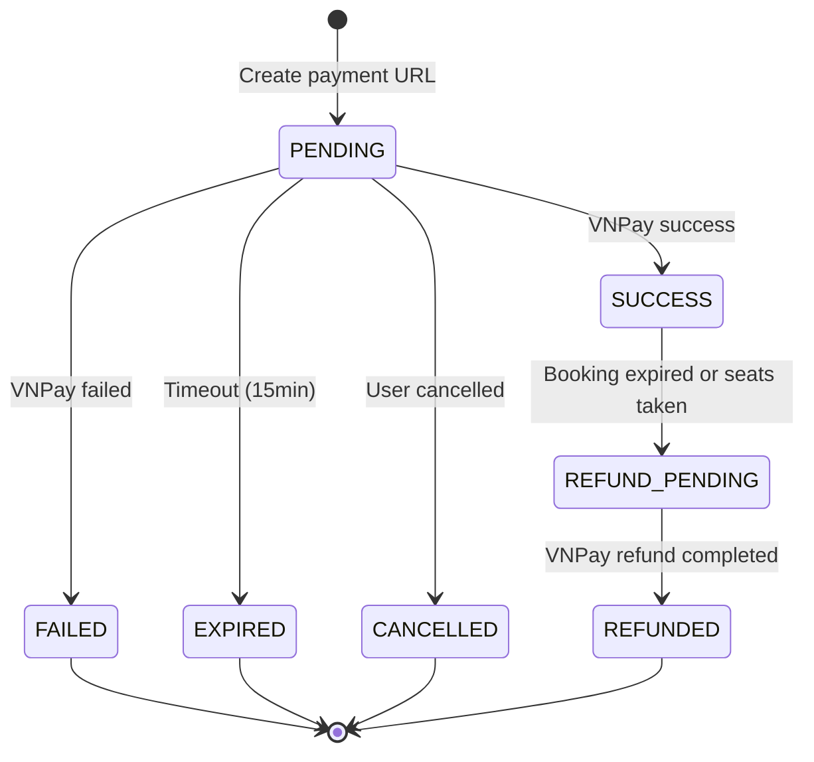

# 💳 Payment Flow - VNPay Integration Guide

> **Status:** ✅ Implemented & Fixed  
> **Last Updated:** November 11, 2025  
> **Gateway:** VNPay Sandbox  
> **Related Issues:** Fixed idempotency, IPN webhook, logging

---

## 📋 OVERVIEW

Payment flow xử lý thanh toán qua VNPay gateway với đầy đủ error handling, idempotency và audit logging.

### **Key Features:**
- ✅ **VNPay Integration** - Sandbox environment
- ✅ **Signature Verification** - HMAC-SHA512 security
- ✅ **Idempotency** - Prevent duplicate processing
- ✅ **IPN Webhook** - Reliable server-to-server notification
- ✅ **Auto-Refund** - Handle expired bookings
- ✅ **Audit Logging** - Full webhook logging

---

## 🔄 COMPLETE FLOW

```
User creates booking (PENDING_PAYMENT)
   ↓
Frontend requests payment URL
   ↓
Backend generates VNPay signed URL
   ↓
User redirects to VNPay & pays
   ↓
   ├─── Return URL (user redirect) ────┐
   │                                    │
   └─── IPN Webhook (server callback) ─┤
                                        ↓
                        Backend verifies signature
                                        ↓
                        ┌───────────────┴───────────────┐
                        │                               │
                   SUCCESS                          FAILED
                        │                               │
                Update booking                   Cancel booking
                  = CONFIRMED                      = CANCELLED
                        │                               │
                  Send email                    Release seats
                  Generate QR                           │
                        │                               │
                        └───────────────┬───────────────┘
                                        ↓
                                    Return response
```

---

## 🚀 API ENDPOINTS

### 1. Create Payment URL

**Endpoint:** `POST /api/v1/bookings/{bookingId}/payment`

**Headers:**
```
Authorization: Bearer {accessToken}
```

**Response:**
```json
{
  "success": true,
  "message": "Redirect to payment gateway. Complete payment within 15 minutes.",
  "data": "https://sandbox.vnpayment.vn/paymentv2/vpcpay.html?vnp_Amount=49500000&vnp_Command=pay&vnp_CreateDate=20241111100000&vnp_CurrCode=VND&vnp_IpAddr=127.0.0.1&vnp_Locale=vn&vnp_OrderInfo=Thanh+toan+ve+xem+phim+-+Booking+%23100&vnp_OrderType=other&vnp_ReturnUrl=http%3A%2F%2Flocalhost%3A8080%2Fapi%2Fv1%2Fpayments%2Fvnpay%2Fcallback&vnp_TmnCode=YOUR_TMN_CODE&vnp_TxnRef=TXN_1699999999_100&vnp_Version=2.1.0&vnp_SecureHash=abc123..."
}
```

**Business Rules:**
- Validate booking status = PENDING_PAYMENT
- Validate booking not expired
- Create PaymentTransaction record (status=PENDING)
- Generate unique txnRef: `TXN_{timestamp}_{bookingId}`
- Sign request with HMAC-SHA512
- Amount in VNPay format: `totalPrice * 100` (VND to xu)

---

### 2. VNPay Return URL (User Redirect)

**Endpoint:** `GET /api/v1/payments/vnpay/callback`

**Query Params (from VNPay):**
```
vnp_Amount=49500000
vnp_BankCode=NCB
vnp_BankTranNo=VNP01234567
vnp_CardType=ATM
vnp_OrderInfo=Thanh toan ve xem phim - Booking #100
vnp_PayDate=20241111100530
vnp_ResponseCode=00
vnp_TmnCode=YOUR_TMN_CODE
vnp_TransactionNo=14012345
vnp_TransactionStatus=00
vnp_TxnRef=TXN_1699999999_100
vnp_SecureHash=xyz789...
```

**Response:**
```json
{
  "success": true,
  "message": "Payment completed successfully",
  "data": {
    "bookingId": 100,
    "status": "SUCCESS"
  }
}
```

**Processing Logic:**
1. **Verify signature** (CRITICAL SECURITY!)
2. **Acquire Redis lock** (`payment:lock:{txnRef}`)
3. **Load transaction with pessimistic lock**
4. **Idempotency check** - If already processed, return cached result
5. **Business validations:**
   - Booking not expired → Refund if expired
   - Seats still available → Refund if taken
6. **Update status:**
   - `vnp_TransactionStatus = 00` → SUCCESS
   - Other codes → FAILED
7. **Post-processing:**
   - Consume seat holds
   - Send email (async)
   - Release Redis lock

---

### 3. VNPay IPN Webhook (Server-to-Server)

**Endpoint:** `POST /api/v1/payments/vnpay/ipn`

**Why IPN?**
- Return URL phụ thuộc browser (user có thể đóng)
- IPN là server-to-server callback (reliable)
- VNPay auto-retry lên đến 10 lần

**Request Body:** (Same as Return URL params)

**Response (VNPay Format):**
```json
{
  "RspCode": "00",
  "Message": "Confirm Success"
}
```

**Processing:**
- Reuse same logic as Return URL
- Idempotency ensures no duplicate processing
- Return VNPay-specific format:
  - `RspCode: 00` → Success (VNPay stops retry)
  - `RspCode: 99` → Error (VNPay retries)

---

### 4. Verify Payment Status

**Endpoint:** `GET /api/v1/bookings/{bookingId}/payment-status`

**Response:**
```json
{
  "success": true,
  "data": "CONFIRMED"
}
```

**Future Enhancement:**
```java
// TODO: Query VNPay API to verify actual status
// https://sandbox.vnpayment.vn/merchant_webapi/api/transaction
```

---

### 5. Cancel Payment

**Endpoint:** `DELETE /api/v1/bookings/{bookingId}/payment`

**Response:**
```json
{
  "success": true,
  "message": "Payment cancelled successfully. Seats are now available."
}
```

**Business Rules:**
- Only cancel PENDING_PAYMENT bookings
- Update booking status = CANCELLED
- Cancel payment transactions (status=CANCELLED)
- Release seat holds

---

## 🔒 SECURITY

### **Signature Verification (CRITICAL!)**

VNPay uses HMAC-SHA512 to sign requests:

```java
// Build sign data (sorted params, exclude vnp_SecureHash)
String signData = "vnp_Amount=49500000&vnp_Command=pay&vnp_CreateDate=...";

// Calculate hash
String calculatedHash = HmacSHA512(hashSecret, signData);

// Verify
if (!calculatedHash.equals(receivedHash)) {
    throw new SecurityException("Invalid signature");
}
```

**⚠️ WITHOUT SIGNATURE VERIFICATION:**
```bash
# Attacker can fake payment success!
curl -X GET "http://localhost:8080/api/v1/payments/vnpay/callback?vnp_TxnRef=TXN_123&vnp_TransactionStatus=00&vnp_SecureHash=FAKE"
→ Booking confirmed without payment! 💸
```

---

## 🔄 IDEMPOTENCY

### **Why Needed?**

```
Scenario:
10:00:00 - User pays successfully
10:00:05 - VNPay Return URL → Backend processes → Booking CONFIRMED ✅
10:00:06 - User refreshes browser → Callback called AGAIN!
10:00:10 - VNPay IPN retry #1 → Callback called AGAIN!
10:00:20 - VNPay IPN retry #2 → Callback called AGAIN!
```

### **Implementation:**

```java
@Transactional(isolation = Isolation.SERIALIZABLE)
public PaymentResponse handleVNPayReturn(HttpServletRequest request) {
    String txnRef = request.getParameter("vnp_TxnRef");
    
    // Step 1: Acquire Redis lock
    Boolean locked = redisTemplate.opsForValue().setIfAbsent(
        "payment:lock:" + txnRef, "locked", 30, TimeUnit.SECONDS
    );
    
    if (!locked) {
        throw new ConflictException("Payment is being processed");
    }
    
    try {
        // Step 2: Pessimistic lock on transaction
        PaymentTransaction txn = repository.findByTransactionIdForUpdate(txnRef);
        
        // Step 3: IDEMPOTENCY CHECK
        if (txn.getStatus() != PaymentStatus.PENDING) {
            log.warn("Duplicate callback, returning cached response");
            return buildCachedResponse(txn);
        }
        
        // Step 4: Process payment (only if PENDING)
        return processPayment(txn);
        
    } finally {
        // Step 5: Release lock
        redisTemplate.delete("payment:lock:" + txnRef);
    }
}
```

---

## 📊 PAYMENT TRANSACTION LIFECYCLE



---

## 📝 AUDIT LOGGING

### **PaymentWebhookLog Entity:**

```java
@Entity
public class PaymentWebhookLog {
    private Long id;
    private PaymentTransaction paymentTransaction;
    private String requestBody;      // All VNPay params
    private String responseBody;     // Our response
    private String ipAddress;        // VNPay server IP
    private String userAgent;
    private LocalDateTime receivedAt;
    private LocalDateTime processedAt;
    private boolean signatureValid;
    private String errorMessage;
}
```

### **Query Examples:**

```sql
-- All callbacks for a booking
SELECT * FROM payment_webhook_logs pwl
JOIN payment_transactions pt ON pwl.payment_transaction_id = pt.id
WHERE pt.booking_id = 100
ORDER BY pwl.received_at DESC;

-- Detect duplicate callbacks
SELECT transaction_id, COUNT(*) as callback_count
FROM payment_webhook_logs
GROUP BY transaction_id
HAVING COUNT(*) > 1;

-- Find signature failures (security alert!)
SELECT * FROM payment_webhook_logs
WHERE signature_valid = false
AND received_at > NOW() - INTERVAL 24 HOUR;
```

---

## 💰 REFUND FLOW

### **When Refund Occurs:**

1. **Booking Expired**
   ```
   User pays successfully BUT booking already expired (> 15min)
   → Auto-refund, notify user
   ```

2. **Seats No Longer Available**
   ```
   During payment, another user booked same seats (race condition)
   → Auto-refund, notify user
   ```

### **Refund Implementation:**

```java
if (booking.getExpiresAt() != null && LocalDateTime.now().isAfter(booking.getExpiresAt())) {
    transaction.setStatus(PaymentStatus.REFUND_PENDING);
    paymentTransactionRepository.save(transaction);
    
    // TODO: Call VNPay refund API
    // POST https://sandbox.vnpayment.vn/merchant_webapi/api/transaction/refund
    // vnPayService.initiateRefund(transaction);
    
    return PaymentResponse.builder()
        .status("REFUND_PENDING")
        .message("Booking expired, refund will be processed within 24h")
        .build();
}
```

---

## 🧪 TESTING

### **Test Cases:**

#### 1. Happy Path
```bash
# Step 1: Create payment
POST /api/v1/bookings/100/payment
→ Get payment URL

# Step 2: Simulate VNPay success callback
GET /vnpay/callback?vnp_TxnRef=TXN_100&vnp_TransactionStatus=00&vnp_SecureHash=...
→ Booking CONFIRMED

# Step 3: Verify idempotency
GET /vnpay/callback?... (same params)
→ Same response, no duplicate processing
```

#### 2. Expired Booking
```bash
# Step 1: Create booking
POST /api/v1/bookings

# Step 2: Wait > 15 minutes (or update expires_at in DB)

# Step 3: Try to pay
POST /api/v1/bookings/100/payment
→ VNPay URL still generated (allowed)

# Step 4: Complete payment
GET /vnpay/callback?...
→ REFUND_PENDING (auto-detected expired)
```

#### 3. Invalid Signature
```bash
GET /vnpay/callback?vnp_TxnRef=TXN_100&vnp_SecureHash=FAKE123
→ 400 Bad Request - "Invalid payment signature"
```

#### 4. IPN Retry
```bash
# Simulate VNPay retry mechanism
for i in {1..3}; do
  curl -X POST /vnpay/ipn -d "vnp_TxnRef=TXN_100&..."
done

# Expected:
# Call 1: Process payment → SUCCESS
# Call 2,3: Idempotent → "already processed"
# Booking only confirmed once
```

---

## 🔧 CONFIGURATION

### **application.yml:**

```yaml
payment:
  vnpay:
    tmnCode: ${VNPAY_TMN_CODE}
    hashSecret: ${VNPAY_HASH_SECRET}
    payUrl: https://sandbox.vnpayment.vn/paymentv2/vpcpay.html
    returnUrl: http://localhost:8080/api/v1/payments/vnpay/callback
    ipnUrl: http://localhost:8080/api/v1/payments/vnpay/ipn
    
    # Production URLs (with HTTPS):
    # returnUrl: https://yourdomain.com/api/v1/payments/vnpay/callback
    # ipnUrl: https://yourdomain.com/api/v1/payments/vnpay/ipn
```

### **Environment Variables:**

```bash
# .env
VNPAY_TMN_CODE=YOUR_MERCHANT_CODE
VNPAY_HASH_SECRET=YOUR_HASH_SECRET
```

### **VNPay Sandbox Credentials:**

Register at: https://sandbox.vnpayment.vn/devreg/

---

## 📊 DATABASE SCHEMA

### **payment_transactions:**

```sql
CREATE TABLE payment_transactions (
    id BIGINT PRIMARY KEY AUTO_INCREMENT,
    booking_id BIGINT NOT NULL,
    transaction_id VARCHAR(255) NOT NULL UNIQUE,
    gateway_type VARCHAR(50) NOT NULL,
    gateway_order_id VARCHAR(255),
    amount DECIMAL(12,2) NOT NULL,
    discount_amount DECIMAL(12,2) DEFAULT 0,
    final_amount DECIMAL(12,2) NOT NULL,
    currency VARCHAR(10) NOT NULL,
    status VARCHAR(50) NOT NULL,
    payment_method VARCHAR(50),
    ip_address VARCHAR(50),
    initiated_at TIMESTAMP NOT NULL,
    completed_at TIMESTAMP,
    created_at TIMESTAMP DEFAULT CURRENT_TIMESTAMP,
    
    INDEX idx_transaction_id (transaction_id),
    INDEX idx_booking_id (booking_id),
    INDEX idx_status (status)
);
```

### **payment_webhook_logs:**

```sql
CREATE TABLE payment_webhook_logs (
    id BIGINT PRIMARY KEY AUTO_INCREMENT,
    payment_transaction_id BIGINT,
    request_body TEXT,
    response_body TEXT,
    ip_address VARCHAR(50),
    user_agent VARCHAR(255),
    received_at TIMESTAMP NOT NULL,
    processed_at TIMESTAMP,
    signature_valid BOOLEAN,
    error_message TEXT,
    
    INDEX idx_payment_transaction (payment_transaction_id),
    INDEX idx_received_at (received_at)
);
```

---

## 🐛 KNOWN ISSUES (FIXED)

| Issue | Status | Fix |
|-------|--------|-----|
| No idempotency | ✅ Fixed | Redis lock + pessimistic lock + status check |
| No IPN webhook | ✅ Fixed | Added POST /vnpay/ipn endpoint |
| No signature verify | ✅ Fixed | HMAC-SHA512 verification |
| No audit logging | ✅ Fixed | PaymentWebhookLog entity |
| No refund handling | ✅ Fixed | Auto-refund for expired/conflict |

---

## 🔜 TODO (Future Enhancements)

- [ ] Implement VNPay refund API call
- [ ] Add email confirmation with QR code
- [ ] Add payment retry mechanism
- [ ] Support multiple payment gateways (MoMo, ZaloPay)
- [ ] Add payment analytics dashboard

---

## 📚 RELATED DOCS

- [Booking Flow](04-BOOKING-FLOW.md) - Previous step before payment
- [API Documentation](02-API-DOCUMENTATION.md) - Full API reference
- [Testing Guide](07-TESTING-GUIDE.md) - Test strategies

---

## 🎯 PRODUCTION CHECKLIST

Before deploying to production:

- [ ] Update VNPay to production credentials
- [ ] Use HTTPS for returnUrl & ipnUrl
- [ ] Configure public domain (not localhost)
- [ ] Enable SSL certificate
- [ ] Set up monitoring for payment failures
- [ ] Configure alerting for signature failures
- [ ] Test refund flow end-to-end
- [ ] Load test payment endpoints
- [ ] Review audit logs regularly
